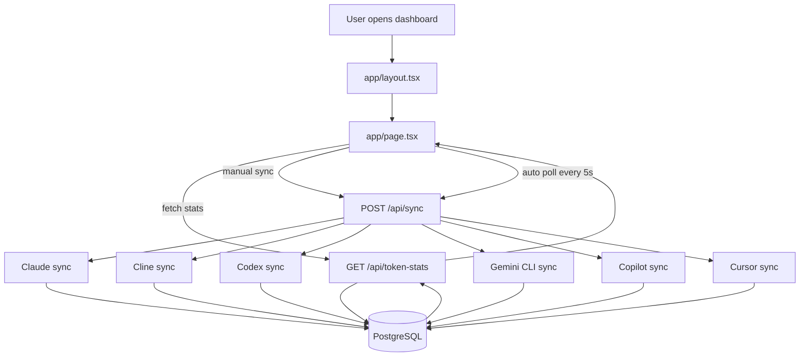
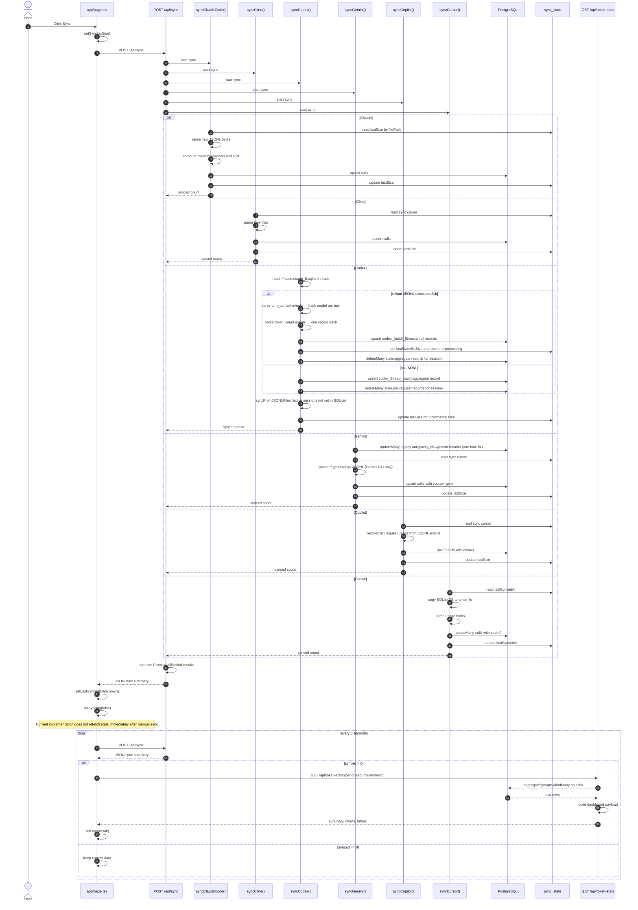

<!-- BEGIN:nextjs-agent-rules -->
# This is NOT the Next.js you know

This version has breaking changes — APIs, conventions, and file structure may all differ from your training data. Read the relevant guide in `node_modules/next/dist/docs/` before writing any code. Heed deprecation notices.
<!-- END:nextjs-agent-rules -->

# Project Flow

## Overview

This project is a unified token analytics dashboard for multiple AI coding tools.

There are 2 main runtime flows:

1. Read flow: browser UI requests aggregated stats from the app database and renders charts and tables.
2. Sync flow: the app scans local log/database files from external tools, normalizes them, stores them into PostgreSQL, then the UI reads the refreshed aggregates.

The central database tables are:

- `calls`: canonical per-call or per-session usage records used by the dashboard
- `sync_state`: incremental sync cursor state per file/data source
- `price_configs`: pricing config table, although current sync adapters mostly embed pricing rules directly

## Main Components

- `app/page.tsx`
  Client dashboard UI.
  Fetches `/api/token-stats`, triggers `/api/sync`, and runs 5-second polling.

- `app/api/token-stats/route.ts`
  Read API.
  Aggregates data from `calls` and returns summary, charts, project stats, session stats, model stats, platform stats, and recent calls.

- `app/api/sync/route.ts`
  Sync orchestrator.
  Calls all platform sync adapters in parallel with `Promise.allSettled`.

- `lib/sync/*.ts`
  Per-source ingestion adapters.
  Each adapter reads raw local files/SQLite DBs, normalizes token usage, applies source-specific cost handling, then writes rows into `calls`.

- `lib/db.ts`
  Prisma client setup for PostgreSQL.

- `prisma/schema.prisma`
  Canonical data model.

## High-Level Runtime Flow



## Detailed Sequence: Sync To UI Refresh



## Source Adapters

### Claude Code

- File: `lib/sync/claude.ts`
- Input: `~/.claude/projects/**/*.jsonl`
- Strategy:
  - Incremental read by byte offset using `sync_state.lastSize`
  - Keep `type: "assistant"` entries only; skip `user`, `queue-operation`, `file-history-snapshot`, `ai-title`, `attachment`, `last-prompt`, `system`
  - Use `requestId` as the canonical `calls.id`
  - Project name = the encoded directory name under `~/.claude/projects/` (e.g. `c--Users-Admin-Desktop-token-dashboard`)
  - Calculate cost from embedded `PRICES` table

#### Claude Code JSONL entry format (top-level keys)

`parentUuid`, `isSidechain`, `message`, `requestId`, `type`, `uuid`, `timestamp`, `userType`, `entrypoint`, `cwd`, `sessionId`, `version`, `gitBranch`

Relevant fields:
- `message.model` — model ID (e.g. `claude-sonnet-4-6-20250514`)
- `message.usage` — token breakdown (see below)
- `requestId` — canonical ID for upsert dedup
- `isSidechain` — `true` for subagent calls; currently 0 observed, but would be included in token counts if present
- `cwd` — actual working directory path (more readable than encoded folder name, but not currently used for `project` field)

#### Claude Code usage fields

```json
{
  "input_tokens": 6,
  "cache_creation_input_tokens": 8836,
  "cache_read_input_tokens": 22508,
  "output_tokens": 194,
  "server_tool_use": { "web_search_requests": 0, "web_fetch_requests": 0 },
  "service_tier": "standard",
  "cache_creation": {
    "ephemeral_1h_input_tokens": 8836,
    "ephemeral_5m_input_tokens": 0
  },
  "iterations": [...],
  "speed": "standard"
}
```

**Important notes:**
- `cache_creation_input_tokens` is the aggregate used for cost — the nested `cache_creation` object splits it into 5m vs 1h ephemeral buckets. Claude Code uses **1h by default** (confirmed from real data: `ephemeral_1h = 8836`, `ephemeral_5m = 0`), so `cacheWrite` pricing uses the 1h rate.
- `service_tier: "priority"` costs 2× standard but 0 observed entries so far — not currently handled.
- `server_tool_use.web_search_requests` billed at ~$0.01/req — 0 observed, not currently handled.
- `iterations` relates to extended thinking passes — aggregate `output_tokens` already includes thinking tokens.

#### Claude Code pricing ($ per 1M tokens)

Source: anthropic.com/pricing, verified 2026-05-22. `cacheWrite` = 1h ephemeral price (Claude Code default).

| Model | Input | Output | Cache Read | Cache Write (1h) |
|---|---|---|---|---|
| Opus 4.8 / 4.7 / 4.6 / 4.5 | $5 | $25 | $0.50 | $10 |
| Opus 4.1 / Opus 4 (legacy) | $15 | $75 | $1.50 | $30 |
| Sonnet 4.6 / 4.5 / 4 | $3 | $15 | $0.30 | $6 |
| Haiku 4.5 | $1 | $5 | $0.10 | $2 |
| Haiku 3.5 | $0.80 | $4 | $0.08 | $1.60 |

**Historical mistake to avoid:** Opus 4.5/4.6/4.7 were at $15 in old code (3× too high — confused with Opus 4.1 pricing). Haiku 4.5 was at $0.25 (4× too low). Always verify at anthropic.com/pricing.

### Cline

- File: `lib/sync/cline.ts`
- Input: VS Code global storage task files
- Strategy:
  - Read `ui_messages.json` plus optional `task_metadata.json`
  - Extract API request events and resolve active model by timestamp
  - Use Cline-reported `cost` directly

### Codex

- File: `lib/sync/codex.ts`
- Inputs:
  - `~/.codex/state_5.sqlite` — threads table: `id, cwd, model, tokens_used, created_at_ms, rollout_path`
  - `~/.codex/sessions/YYYY/MM/DD/rollout-{DATE}-{uuid}.jsonl` — per-turn event stream

#### Codex sync strategy (read carefully before touching this adapter)

Two functions run in sequence:

1. **`syncFromSQLite()`** — iterates every thread with `tokens_used > 0`
   - `rollout_path` is recorded by the Codex CLI on the HOST OS (e.g. `C:\Users\...`). `resolveRolloutPath()` remaps the part after `.codex` onto the current `homedir()` so the check also works inside Docker (`HOME=/host-home`). Never test `existsSync(thread.rollout_path)` directly — that bug once flipped every session to aggregate fallback inside the container and deleted all accurate per-request records.
   - If the resolved rollout file exists → **per-request mode**:
     - Reads the entire rollout JSONL, tracks model via `turn_context` events, creates one DB record per `token_count` event
     - Record ID format: `codex_{thread_uuid}_{iso_timestamp}`
     - After processing, sets `syncState.lastSize = fileSize` so `syncJSONLFile` skips this file
     - Runs `deleteMany` to clean up any stale aggregate or old-format records for the same session
   - If rollout file is missing → **aggregate fallback**:
     - **Guard:** if per-request records (`codex_{uuid}_*`) already exist for the session, the fallback is skipped entirely — never replace accurate per-request data with an input-only total
     - Creates a single record `codex_thread_{thread_uuid}` using `tokens_used` from SQLite
     - Also runs `deleteMany` to remove any stale per-request records

2. **`syncFromJSONLFiles()`** — walks `~/.codex/sessions/` tree
   - For each `.jsonl` file, calls `syncJSONLFile()`
   - `syncJSONLFile` checks `syncState.lastSize`: if file not grown, returns 0 immediately
   - This catches sessions that are still active and not yet indexed in SQLite

#### Codex JSONL rollout file format

Critical — do not assume standard structure. Actual event types found in rollout files:

| Event type | Structure | Purpose |
|---|---|---|
| `session_meta` | `{ type: "session_meta", payload: { id, cwd, model_provider, ... } }` | Session metadata. Has `cwd` for project name. **Does NOT have `model` field.** |
| `turn_context` | `{ type: "turn_context", payload: { turn_id, model, ... } }` | Emitted at start of each turn. **This is the authoritative source for per-turn model.** |
| `event_msg` | `{ type: "event_msg", payload: { type: "token_count", info: { last_token_usage, total_token_usage } } }` | Token usage per API call. `last_token_usage` = this request only; `total_token_usage` = cumulative. |

**Model tracking rule:** iterate lines in order, update `currentModel` on every `turn_context` event, attribute each subsequent `token_count` to `currentModel`. Do NOT read model from `session_meta` — it only has `model_provider: "openai"`, not the actual model name.

#### Codex double-count prevention

- `syncFromSQLite` per-request mode updates `syncState.filePath = "codex:{absolute_path}"` after processing, marking the file as fully handled.
- `syncJSONLFile` checks `currentSize <= lastSize` as its first action — returns 0 if the file has not grown since last processing.
- `deleteMany(where: { source: "codex", id: { contains: thread.id }, NOT: { id: { in: keptIds } } })` cleans up any leftover records from old formats (e.g. `codex_rollout-DATE-{uuid}_timestamp` from an earlier broken sync).

#### Codex record ID conventions

| Scenario | ID format | Notes |
|---|---|---|
| Session with JSONL (per-request) | `codex_{uuid}_{iso_timestamp}` | One record per `token_count` event |
| Session without JSONL (aggregate) | `codex_thread_{uuid}` | One record per SQLite thread, rough cost estimate |

When querying for "all records belonging to session X", use `id LIKE 'codex_%{uuid}%'` or Prisma `id: { contains: uuid }`.

#### Codex pricing

Codex CLI uses OpenAI API token-based billing. Prices are in `lib/sync/codex.ts` `PRICES` map and mirrored in `lib/recalculate.ts`. Source: platform.openai.com/docs/pricing (verified 2026-05-22).

| Model | Input $/1M | Cached $/1M | Output $/1M |
|---|---|---|---|
| gpt-5.5 | 5.00 | 0.50 | 30.00 |
| gpt-5.4 | 2.50 | 0.25 | 15.00 |
| gpt-5.3-codex / codex | 1.25 | 0.125 | 10.00 |
| gpt-5.4-mini | 0.75 | 0.075 | 4.50 |

Long context (>128K tokens) is 2× input/cache for gpt-5.4 and gpt-5.5. Current adapter uses short-context prices as default.

**If you update pricing in `lib/sync/codex.ts`, also update `lib/recalculate.ts`** and tell the user to click "Recalc $" in the UI to retroactively fix existing DB records.

### Gemini CLI

- File: `lib/sync/gemini.ts`
- Input: `~/.gemini/tmp/{project}/chats/*.jsonl`
- Source value: always `"gemini"`
- Strategy:
  - Parse chat JSONL incrementally by byte offset (`syncState.lastSize`)
  - All sessions in `~/.gemini/tmp/` are Gemini CLI — no source detection needed
  - Calculate cost from `GEMINI_PRICES` table
  - On each sync run: auto-corrects any legacy records that were wrongly labeled `antigravity_cli` (from old marker-based detection) back to `gemini`

#### Gemini JSONL entry format

```
Line 0: { sessionId, projectHash, startTime, lastUpdated, kind }   ← session metadata
Line N: { id, timestamp, type: "user", content }                    ← user message
Line N: { id, timestamp, type: "gemini", model, tokens, content }   ← model response
Line N: { id, timestamp, type: "info", content }                    ← info/system
```

Token fields in `tokens`: `input`, `output`, `cached`, `thoughts`, `tool`, `total`.
`output` and `thoughts` are summed as total output for cost calculation.
`kind` is always `"main"` for all observed sessions — not useful for source detection.

#### Gemini pricing ($ per 1M tokens)

Source: Google AI Studio pay-as-you-go, verified 2026-05-22. `cacheRead` = 25% of input.
Note: `gemini-2.5-pro` doubles to $2.50/$15.00 for prompts >200K tokens — adapter uses base price.

| Model | Input | Output | Cache Read |
|---|---|---|---|
| gemini-3.1-pro-preview | $2.00 | $12.00 | $0.50 |
| gemini-3-flash-preview | $0.50 | $3.00 | $0.125 |
| gemini-3.1-flash-lite-preview | $0.25 | $1.50 | $0.0625 |
| gemini-2.5-pro | $1.25 | $10.00 | $0.3125 |
| gemini-2.5-flash | $0.30 | $2.50 | $0.075 |
| gemini-2.5-flash-lite | $0.10 | $0.40 | $0.025 |
| gemma-4-31b-it | $0.13 | $0.38 | $0 |
| gemma-4-26b-a4b-it | $0.07 | $0.34 | $0 |

Gemma prices are averages across commercial API hosts (DeepInfra, OpenRouter, Together AI).

### Antigravity CLI / IDE — data not accessible

**Antigravity stores ALL data as protobuf binary (`.pb`). There is no JSONL format.**

| Product | Storage path | Format | Readable? |
|---|---|---|---|
| Antigravity CLI | `~/.gemini/antigravity-cli/conversations/*.pb` | Protobuf | ✗ |
| Antigravity IDE | `~/.gemini/antigravity-ide/conversations/*.pb` | Protobuf | ✗ |

Antigravity does **NOT** write to `~/.gemini/tmp/`. That folder is exclusively Gemini CLI.

The `.antigravitycli` file marker found in some project directories (e.g. `token-dashboard/.antigravitycli`) means Antigravity was initialized for that project — it does NOT mean any session in `~/.gemini/tmp/` came from Antigravity. Do not use this marker for source attribution.

If Antigravity adds a JSONL export in the future, add a new adapter reading from `~/.gemini/antigravity-cli/` or `~/.gemini/antigravity-ide/`. Until then, Antigravity usage is not tracked by this dashboard.

### GitHub Copilot

- File: `lib/sync/copilot.ts`
- Input: `workspaceStorage/*/chatSessions/*.jsonl`
- Strategy:
  - Reconstruct requests from multiple event kinds
  - Cost is stored as `0` because billing is treated as subscription-based

### Cursor

- File: `lib/sync/cursor.ts`
- Status: **⚠️ DISABLED** — storage format changed, token data not accessible
- Previous input (no longer available):
  - `.../User/globalStorage/state.vscdb` — SQLite keys like `bubbleId:*`, `composer.composerData*`, `aichat.chatdata*` no longer exist
  - `.../User/workspaceStorage/*/state.vscdb` — same issue
- Current data locations:
  - `~/.cursor/projects/*/agent-transcripts/*/` — JSONL files with conversation history (no token counts)
  - `AppData/Roaming/Cursor/User/globalStorage/state.vscdb` — migrated to antigravity format, `chat.ChatSessionStore.index` is empty

#### Cursor storage migration issue (2025-2026)

Cursor underwent a breaking change:
- Old keys (`bubbleId:*`, `composer.composerData*`) no longer used
- Migrated to antigravity-based storage
- Chat session store (`chat.ChatSessionStore.index`) is empty in current data
- Agent transcripts (JSONL) contain conversation history but **no token/usage data**

**Why sync is disabled:**
1. No readable token counts available in any storage location
2. JSONL has conversation history but not API usage metrics
3. Unable to calculate cost (always 0, but also can't track usage)
4. Awaiting Cursor to expose usage data via API or new storage format

**How to re-enable:**
- Contact Cursor team to expose token usage metrics
- Or wait for storage format documentation/export feature
- When available, implement JSONL parser with token extraction

## Pricing System

### Centralized pricing

All pricing tables are duplicated in two places that must stay in sync:

| File | Role |
|---|---|
| `lib/sync/codex.ts` — `PRICES` | Used during sync to calculate cost for new records |
| `lib/sync/claude.ts` — `PRICES` | Same, for Claude Code / Cline |
| `lib/sync/gemini.ts` — `GEMINI_PRICES` | Same, for Gemini CLI |
| `lib/recalculate.ts` | Mirrors all of the above; used for retroactive cost recalculation |

### Recalculate endpoint

`POST /api/recalculate-prices` (`app/api/recalculate-prices/route.ts`) calls `recalculateCosts()` in `lib/recalculate.ts`.

It:
1. Fetches every record from `calls`
2. Looks up the correct `ModelPrice` by `(source, model)`
3. Calls `calcCost(price, tokens)` using stored token counts
4. Updates `cost`, `unitPriceInput`, `unitPriceOutput` in place — **does not delete or recreate any records**
5. Returns `{ updated, skipped }` (skipped = subscription-based sources with cost=0 like copilot/cursor)

The UI "Recalc $" button in the header triggers this endpoint and refetches stats afterwards.

**When to use:** after changing any price in a sync adapter's `PRICES` map, the existing DB records still carry the old cost. Click "Recalc $" (or call the endpoint) to apply updated pricing retroactively.

### Cost sources by platform

| Source | Cost method |
|---|---|
| `claude_code` | Calculated from tokens × pricing table |
| `cline` | Calculated from tokens × pricing table |
| `codex` | Calculated from tokens × pricing table |
| `gemini` | Calculated from tokens × pricing table |
| `antigravity_cli` | No new records — data stored as protobuf, not accessible |
| `copilot` | Always `0` — subscription billing |
| `cursor` | Always `0` — subscription billing |

## Multiplayer Race & Shop (race-server)

The `/race` and `/live` screens are a multiplayer game on top of usage data. They
talk to a **separate, standalone server** in `race-server/` (plain Node `http` +
raw `pg`, NOT Next.js, NOT Prisma) backed by a **shared PostgreSQL DB** that all
friends point at. This is a different DB from the dashboard's local `calls` DB.

### Two databases — do not confuse them

| DB | Owner | Accessed via | Tables |
|---|---|---|---|
| Dashboard DB | Each machine, private | Prisma (`lib/db.ts`) | `calls`, `sync_state`, `price_configs`, `daily_balances` |
| Race DB | One shared instance everyone connects to | raw `pg` in `race-server/server.js` | `race_users`, `race_snapshots`, `race_shop_profiles`, `race_purchases` |

### Data flow

- Each dashboard syncs its own logs → local `calls`.
- On every sync, `app/api/sync/route.ts` aggregates the race-window totals and
  calls `reportToRace(totalTokens, totalCost, period, lifetimeCost)`
  (`lib/race-reporter.ts`) → `POST {RACE_SERVER_URL}/report`. The reporter
  auto-logins with `RACE_PLAYER_NAME`/`RACE_PLAYER_PASSWORD` and caches a JWT.
  - `totalCost` = windowed USD (resets with the race window; shown on the board).
  - `lifetimeCost` = all-time `SUM(calls.cost)` → feeds the shop wallet.
- `components/MultiplayerRace.tsx` polls `GET {serverUrl}/live` every 5s and
  renders the canvas. `/race` competes; `/live` is a read-only projector
  (spectator) screen.

### Shop = single source of truth on the shared DB

The rocket shop (skins, colors, plasma color, wallet, purchase history) lives
**entirely on the race-server**, so every player AND every spectator sees the
same ship per player. (It used to live in a per-machine Prisma `rocket_profiles`
table + `/api/rocket-profile` — both removed. `lib/rocket-config.ts` localStorage
is kept only as an instant-preview cache for the *current* player between polls.)

- `race_shop_profiles(player_name PK, selected_skin, selected_color, flame_color,
  unlocked_skins[], spent_coins, total_earned)` — keyed by `player_name` =
  `race_snapshots.player_name` = JWT `display_name`, so `/live` LEFT JOINs it.
- `race_purchases(player_name, skin_id, price, purchased_at)` — append-only log.
- **Wallet:** `availableCoins = total_earned − spent_coins` (floored at 0),
  always recomputed **server-side** — never trusted from the client.
  `total_earned` is set by `/report` via `GREATEST(existing, lifetimeCost)`
  (monotonic + idempotent, so a partial sync can't shrink the wallet).

### Race-server endpoints

| Endpoint | Auth | Purpose |
|---|---|---|
| `POST /report` | JWT | Insert snapshot; upsert `total_earned` from `lifetimeCost` |
| `GET /live` | public | Latest snapshot per player today + LEFT JOIN skin/color/flame |
| `GET /shop/profile?name=` | public | Profile + derived `availableCoins` |
| `GET /shop/purchases?name=` | public | Purchase history |
| `POST /shop/buy` | JWT | Server-authoritative buy — price from `SKIN_PRICES`, wallet recomputed under `SELECT … FOR UPDATE`, writes profile + `race_purchases` in one txn |
| `POST /shop/equip` | JWT | Cosmetic change (skin must be owned; colors are `#hex` or null) |

`SKIN_PRICES` in `race-server/server.js` is the authoritative price list and must
stay in sync with the `SKINS` array in `components/SkinShopModal.tsx`.

### Non-obvious rules

- **Stateless server (do not break):** the race-server keeps NO in-memory player
  state. Every write touches only the JWT-authenticated player's own row. Buying
  uses a row-locked transaction. This is what makes multiple instances against
  one shared DB safe (no split-brain). Never reintroduce in-memory aggregates.
- **Never trust client coins/prices.** `/shop/buy` ignores any client-sent price
  and recomputes `availableCoins` itself.
- **Schema is additive + idempotent.** `initDb()` uses `CREATE TABLE IF NOT
  EXISTS`, so restarting the shared server is enough to create the shop tables —
  friends don't migrate anything for the race DB.
- **Cosmetics render for everyone.** `MultiplayerRace.frame()` reads
  `skin/hullColor/flameColor` per rocket from `/live`. The `/live` field `color`
  (chosen hull color) is renamed to `hullColor` on the client so it doesn't
  collide with the name-hash race/HUD color.

## Read API Behavior

`app/api/token-stats/route.ts` does the following:

1. Parse filters: `period`, `source`, and optional custom `from` / `to`.
2. Build a Prisma `where` clause on `timestamp` and optional `source`.
3. Query `calls` in parallel using:
   - `findMany` for chart rows
   - `aggregate` for totals
   - `groupBy` for sessions
   - `groupBy` for projects
   - `groupBy` for models
   - `groupBy` for platforms, filtered by time only so platform totals can still show all sources
   - `findMany` for recent calls
4. Convert raw rows into dashboard-friendly payloads.
5. Return a single JSON payload consumed by the client dashboard.

## UI Behavior

`app/page.tsx` currently behaves like this:

- On filter change, fetch `/api/token-stats`
- On manual sync, call `/api/sync`
- Every 5 seconds, call `/api/sync` again
- If polling sees `synced > 0`, immediately refetch `/api/token-stats`
- Render charts and tables from the API payload

Important nuance:

- Manual sync updates `lastSynced`, but does not directly refetch stats in the same click path
- Visible dashboard refresh usually happens on the next polling cycle when new data was detected

## Files To Read First

When working on this repo, start from these files:

1. `app/page.tsx`
2. `app/api/token-stats/route.ts`
3. `app/api/sync/route.ts`
4. `lib/sync/codex.ts` — most complex adapter; read the Codex section above before editing
5. `lib/sync/claude.ts`
6. `lib/sync/gemini.ts`
7. `lib/recalculate.ts` — centralized pricing + retroactive cost update
8. `prisma/schema.prisma`

## Known Constraints and Non-Obvious Behaviors

- **Codex 2025 data is permanently lost.** The Codex CLI deletes old JSONL session files. `state_5.sqlite` only starts from 2026-01-16. No recovery path exists for sessions before that date.
- **`syncState.lastSize` is the only dedup guard for JSONL files.** If you delete a `syncState` row, the corresponding file will be fully re-processed on next sync, potentially creating duplicate records.
- **`deleteMany(id: { contains: thread.id })` is intentional.** Codex sessions appear in both SQLite (aggregate) and JSONL (per-request). The contains-match cleans up whichever format was written first. Do not replace it with an exact-ID match.
- **Recalculate does not re-sync.** The "Recalc $" button only updates cost fields on existing records. It does not re-read source files or change token counts.
- **`scripts/` directory is excluded from `tsconfig.json`.** Debug/utility scripts live there but are not part of the Next.js build. Run them with `npx tsx scripts/foo.ts`.
- **The `turn_context` event is the only reliable source for per-turn model in Codex JSONL.** `session_meta` only has `model_provider: "openai"`, not the actual model name like `gpt-5.4`.
- **Antigravity data is inaccessible.** Both Antigravity CLI and Antigravity IDE store conversations as protobuf binary (`.pb`) in `~/.gemini/antigravity-cli/` and `~/.gemini/antigravity-ide/`. No schema is available to decode them. If a new readable format appears, add a dedicated adapter; do not attempt to read `.pb` files.
- **`.antigravitycli` file marker does NOT identify Antigravity sessions.** This marker is placed in project directories when Antigravity is initialized for that project, but ALL sessions in `~/.gemini/tmp/` are from Gemini CLI regardless. Old code used this marker to re-attribute Gemini sessions as `antigravity_cli` — this was wrong and has been removed. Do not re-add marker-based source detection.
- **`syncGemini()` auto-corrects legacy misattributed records.** On each sync, it runs `updateMany` to flip any `source="antigravity_cli"` records with Gemini model IDs back to `source="gemini"`. This is a permanent idempotent cleanup for the old marker-based bug.
- **Model label truncation in ModelChart.** YAxis `width={120}` supports labels up to ~14 chars at 11px. If you add models with longer display names (>14 chars), either increase `width` in `ModelChart.tsx` or shorten the label in `MODEL_LABEL` in `token-stats/route.ts`. Both Gemini and Claude model IDs have versioned suffixes (e.g. `claude-opus-4-7-20250219`) — the prefix-matching fallback in `modelLabel()` handles these automatically.
- **After any pricing change, click "Recalc $".** Both `lib/sync/*.ts` (used at sync time) and `lib/recalculate.ts` (used by "Recalc $") must be updated together. The DB stores the cost at write time and does not recompute automatically.
- **Cursor sync is currently disabled.** As of 2026-05-22, Cursor changed its storage format (migrated to antigravity backend) and no longer exposes token usage in accessible format. SQLite keys like `bubbleId:*` and `composer.composerData*` no longer exist, and agent transcript JSONL files contain only conversation history with no token counts. Re-enable when/if Cursor provides usage metrics API or documents the new storage format.
